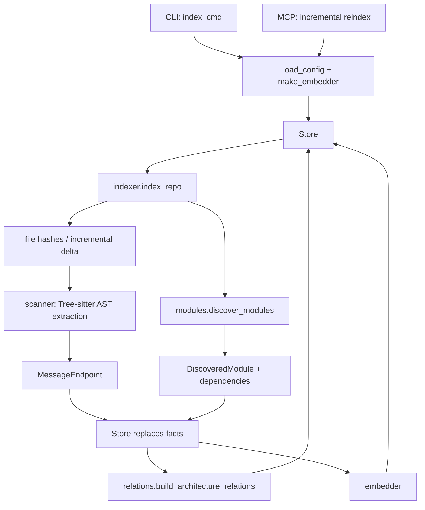
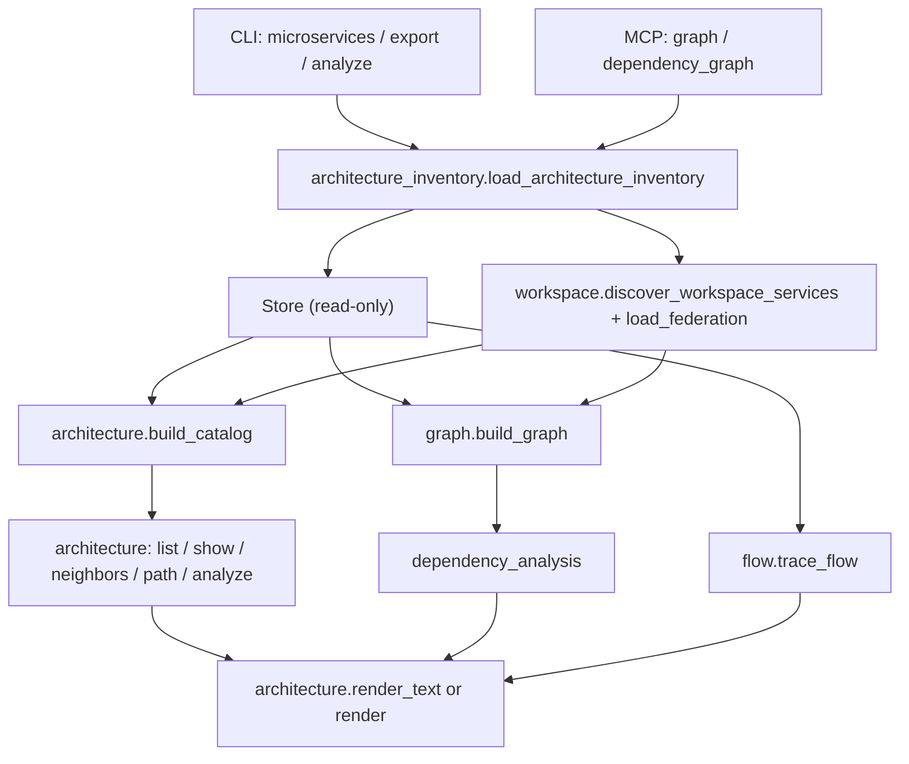

# Code architecture guide

This guide is the starting point for maintainers. It complements the detailed
contracts in `SPEC-TECH.md`: read this document to find the right ownership
boundary, then read the relevant specification before changing behaviour.

## Runtime layers

```
CLI / MCP adapters (`cli.py`, `mcp_server.py`)
                |
application queries and indexing (`architecture.py`, `architecture_inventory.py`,
`flow.py`, `dependency_analysis.py`, `indexer.py`, `workspace.py`)
                |
facts and discovery (`scanner.py`, `modules.py`, `maven.py`, `gradle.py`,
`java_parser.py`, `relations.py`)
                |
models and persistence (`models.py`, `store.py`)
```

`render.py` is an output adapter. It may consume query results and models, but
must not perform indexing or persist data. `config.py`, `paths.py`, and
`inventory_freshness.py` are small cross-cutting utilities.

## Call hierarchies

The following are the authoritative execution paths. Read from top to bottom:
each level calls the next one. `Store` is the only component that owns the
SQLite database.

### Indexing



`indexer.index_repo` is the orchestration root once input has crossed an
adapter. Scanner and module discovery are siblings: neither should orchestrate
the other.

### Architecture exploration



There are two valid sources of facts: the current repository index (`Store`)
or a read-only federation of separately indexed services (`workspace`).
`architecture_inventory.load_architecture_inventory` normalizes both sources,
including freshness and incomplete-federation warnings, before graph and audit
queries use them. The catalog, graph, dependency audit, and flow tracing are
all derived views: they must not write back to the index.

### Reading a call site

Start at its adapter decorator (`@app.command` or `@mcp.tool`), follow the
first non-private application function, then stop at either a query module or
`indexer.index_repo`. Private helpers only refine the behaviour of their owner;
they are not cross-module entry points.

## Ownership map

| Need to change | Start in |
|---|---|
| CLI parsing, option validation, exit code | `cli.py` |
| MCP tool signature or transport concern | `mcp_server.py` |
| A user query over the architecture inventory | `architecture.py`, `flow.py`, or `dependency_analysis.py` |
| Java AST endpoint extraction | `scanner.py` |
| Maven/Gradle module facts or Java source inventory | `modules.py`, `maven.py`, `gradle.py` |
| SQLite schema or queries | `store.py` |
| JSON, terminal, HTML, D2, or LikeC4 presentation | `render.py` |

## Dependency rules

1. Entry points adapt input and output; they do not implement discovery
   algorithms.
2. Discovery modules return models or typed facts and never import CLI, MCP,
   rendering, or persistence adapters.
3. Use a named public function for a cross-module dependency. Do not import a
   name beginning with `_` from another module.
4. Add a focused test beside the owning module. End-to-end tests cover the
   adapter wiring; they are not the first home for an extraction rule.
5. Keep new output formats in `render.py` (or a future dedicated renderer),
   not in query or discovery code.

## Maintenance focus

`scanner.py`, `render.py`, and `cli.py` are the largest modules. Refactor them
only behind named public contracts and focused tests. Behavioural CLI and MCP
specifications remain the compatibility gate.
